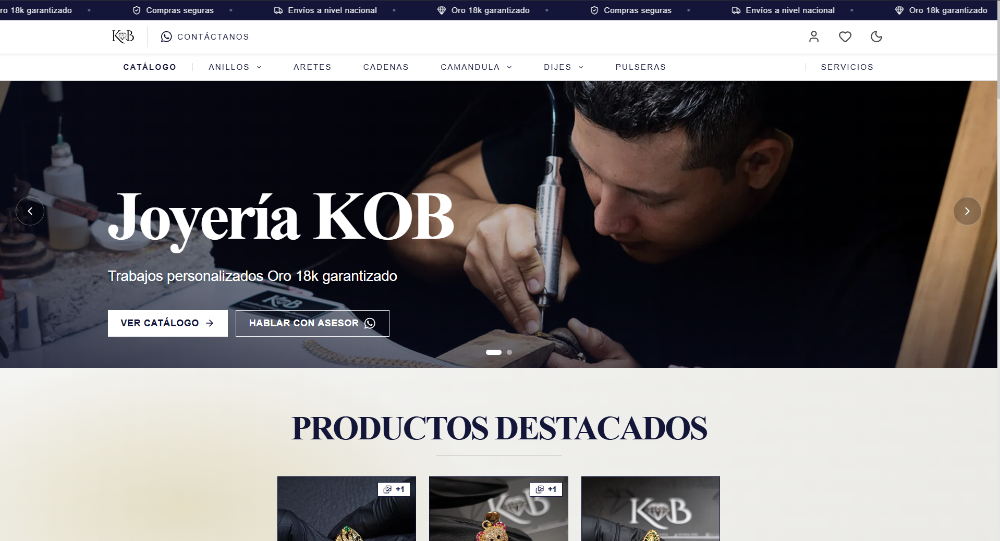
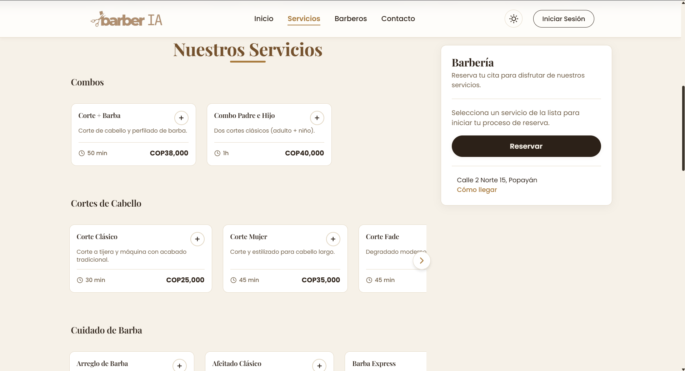
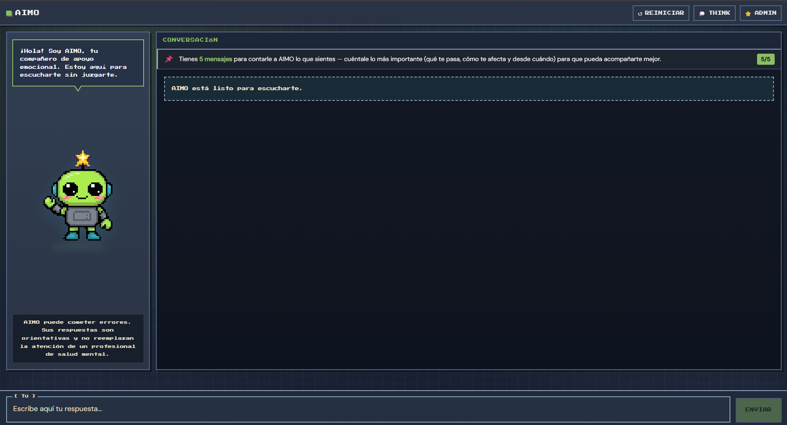

  

 

## 👨‍💻 About Me

  I am a Systems Engineering student at the University of Cauca with a strong interest in building efficient and scalable software solutions. I am driven by the challenge of learning new technologies and applying them to solve complex problems.

- 🔭 I’m currently focused on **university projects and coursework**.
- 🌱 I’m currently learning **Prompt engineering and LLMs**.
- 💬 Ask me about **UX/UI and Front design**.
- 📫 How to reach me: **juandiego12345512@gmail.com**.
- 😄 Fun fact: **I love to cook**.

 

## 📊 GitHub Stats

  
  

  

 

## 🛠️ Tech Stack & Skills

  <strong>Languages:</strong> 
  
  
  
  
  
  
  

  <strong>Frontend Development:</strong> 
  
  
  
  
  
  

  <strong>Backend Development:</strong> 
  
  
  
  

  <strong>Databases:</strong> 
  
  
  
  
  

  <strong>Tools, Platforms & Deployment:</strong> 
  
  
  
  
  
  

 

## 🚀 Featured Projects

> Los tres proyectos están **actualmente en desarrollo activo** 🚧 y desplegados en producción.

### 💎 Joyería KOB
<table>
<tr>
<td width="55%">

E-commerce de joyería personalizada con catálogo de productos y personalizador de anillos. Construido como dos repositorios independientes (frontend/backend) siguiendo arquitectura de Puertos y Fachadas, con documentación de API completa en Swagger y testing con Jest.

**Stack:**

    
 
    

🔗 **Demo:** [joyeriakob.com](https://www.joyeriakob.com/)
📦 **Repos:** [Frontend](https://github.com/JDiegoG12/joyeria-kob-frontend) · [Backend](https://github.com/JDiegoG12/joyeria-kob-backend)

</td>
<td width="45%">

</td>
</tr>
</table>

---

### 💈 BarberIA
<table>
<tr>
<td width="55%">

Plataforma de reservas para una barbería premium, con experiencia de agendamiento de citas pensada para una UX moderna y fluida. Contenerizado con Docker y servido vía Nginx, con CI configurado en GitHub Actions.

**Stack:**

     

🔗 **Demo:** [BarberIA](https://jdiegog12.github.io/barberFront/)
📦 **Repo:** [barberFront](https://github.com/JDiegoG12/barberFront)

</td>
<td width="45%">

</td>
</tr>
</table>

---

### 🤖 AIMO — Sistema Inteligente de Acompañamiento Emocional
<table>
<tr>
<td width="55%">

Asistente conversacional de acompañamiento emocional para estudiantes universitarios, con una arquitectura de **3 agentes de IA en cascada** (contexto, clasificación de riesgo y recomendaciones) más un módulo de moderación de contenido y un sistema propio de evaluación de empatía (AERI). Proyecto académico desarrollado en equipo en la Universidad del Cauca.

**Stack:**

        

🔗 **Demo:** [aimo-v2.onrender.com](https://aimo-v2.onrender.com/)
📦 **Repo:** [AIMO](https://github.com/JDiegoG12/AIMO)

👥 **Equipo:** [Juan Diego Gómez Garcés](https://github.com/JDiegoG12) · [Ana Sofia Arango Yanza](https://github.com/Sofii141) · [Juan David Vela Coronado](https://github.com/juanvec06)

</td>
<td width="45%">

</td>
</tr>
</table>

 

## 🐍 My GitHub Snake

  

 

## 🤝 Connect with Me

  
  
  

 

  <i>Building the future, one line of code at a time.</i>

